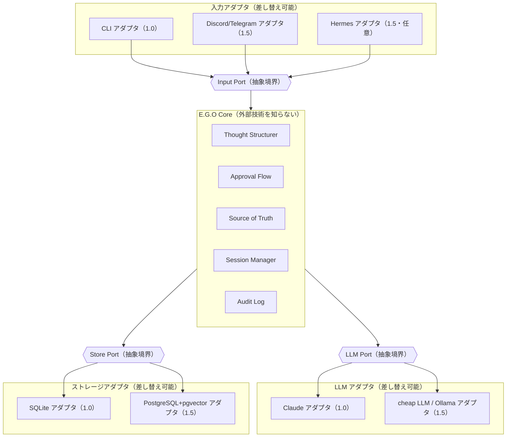
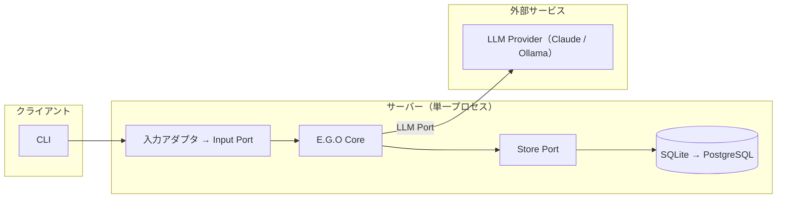
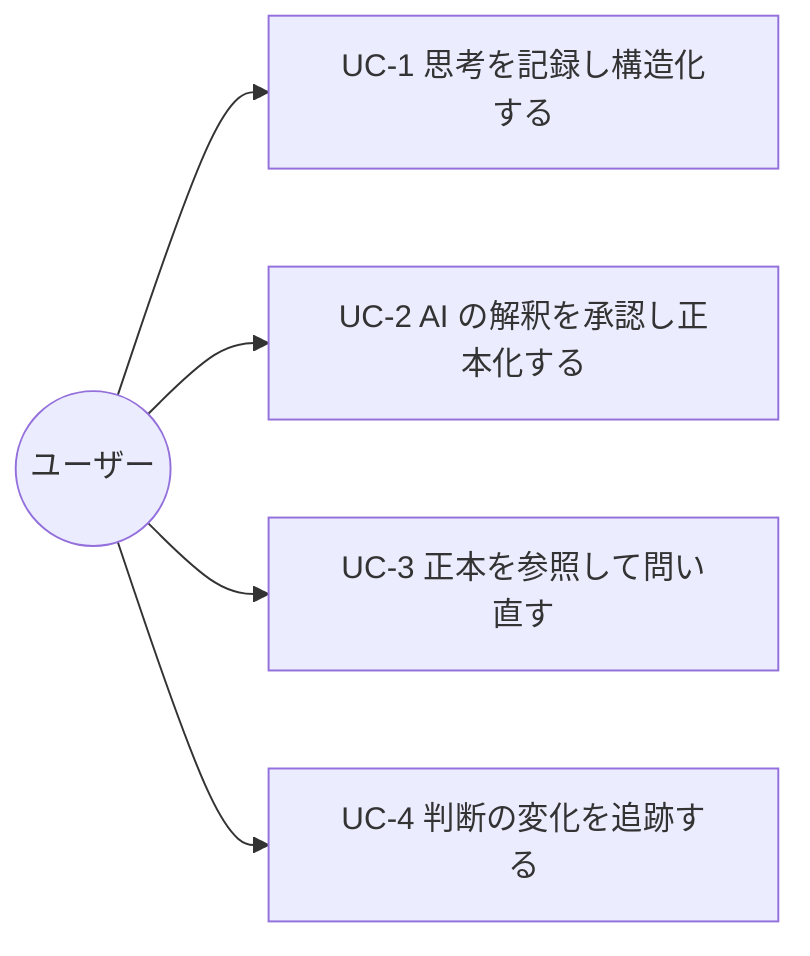
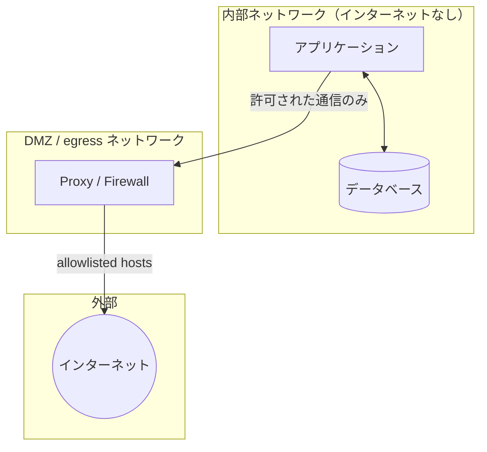

# E.G.O 基本設計書

## 文書情報

| 項目 | 内容 |
|---|---|
| 文書名 | E.G.O 基本設計書 |
| バージョン | 0.3（疎結合アーキテクチャ＋スコープ外反映版） |
| 作成日 | 2026-07-18 |
| 作成者 | 石井恭平 |
| 参照リポジトリ/URL | https://github.com/Kyo-arch-2026/ego-design |

## 改訂履歴

| 版 | 日付 | 変更内容 | 作成者 |
|---|---|---|---|
| 0.1 | 2026-07-18 | 初版作成（設計フェーズ。実装着手前） | 石井恭平 |
| 0.2 | 2026-07-18 | 入力層の Hermes 依存を解消し、入力・LLM・ストレージを抽象ポートで隔離する疎結合方針を反映 | 石井恭平 |
| 0.3 | 2026-07-18 | スコープ外（Non-Goals）を追記（暫定・見直し余地ありと明示） | 石井恭平 |

---

## 1. システム概要

### 1.1 システムの目的

E.G.O は、AI（人工知能）を使いながら「これは本当に自分の考えか、AI の解釈に置き換えられたものではないか」を確認できる、個人用 AI 基盤である。

AI を「自分の意思を増幅する鏡」ではなく「自分が思い込みに陥っていないかを確認する鏡」として位置づける。対話によって可視化された意思をその場限りで消えさせず記録として残し、判断がいつ・どのように変化したかを追跡可能にする。自我を定義するためのツールではなく、自我が自分のものであり続けることを確認するための装置である。

### 1.2 背景・動機

出発点は「自分が正しいと思い込んでいないか」という問いである。判断は記録する仕組みがなければ薄れ、変質し、「最初からそう思っていた」ことにすり替わる。AI の利用はこれを深刻にした。AI は文脈を誤って記憶することがあり、何をどう覚えているかも確認しにくい。AI の解釈と自分の考えが混ざると、両者の境界が曖昧になる。

便利さを手放すことは解決にならない。E.G.O は「機能性こそが能動性の前提」と考える。便利で手間の少ないものでなければ人は能動的に使い続けられない。ゆえに、便利に使いながら自分の考えと AI の解釈の境界を保て、かつ保守の手間が小さい仕組みが必要になる。これが E.G.O を設計する動機である。

> 詳細な背景は `docs/00-origin-story.md`、設計思想は `docs/01-philosophy.md` を参照。

### 1.3 適用範囲

本書は E.G.O 全体の基本方針を対象とする。フェーズ区分は以下。

- **Phase 1.0（本書の主対象／実装予定）**：「思想が機能するか」を検証する最小実装。3 つの抽象ポート（入力・LLM・ストレージ）を定義し、入力は CLI アダプタ、LLM は Claude アダプタ、ストレージは SQLite アダプタで実装する。
- **Phase 1.5（計画中）**：PostgreSQL + pgvector アダプタの追加、入力アダプタの拡充、並列 cheap LLM。
- **Phase 1.5 以降（課題）**：AI の解釈過程そのものの可視化。

本書作成時点で E.G.O は設計フェーズにあり、コードや動作する実装はまだ存在しない。

### 1.4 前提条件・制約事項

- **個人利用が前提**：個人の判断データを扱う。データは手元に置き、当面は単一デバイス利用を想定する。
- **常駐コンポーネントを増やさない（原則3）**：機能追加は新サービスや DB を増やさず、アダプタ追加・プラグインで行う。
- **LLM は補助役に徹する（原則2）**：最終判断は必ず人間が行う。AI が構造化した内容は人間の承認を経て初めて正本になる。
- **外部技術に依存しない（疎結合）**：入力元・LLM プロバイダー・ストレージは抽象ポートで隔離し、具体技術（Hermes／Claude／SQLite 等）はアダプタに閉じ込める。特定技術のバージョン更新が Core に波及しないようにする。
- **技術的制約**：Phase 1.0 はベクトル検索を持たない（SQLite アダプタのため）。ベクトル検索は PostgreSQL アダプタ導入後の Phase 1.5。
- **コスト制約**：個人開発段階ではクラウド常駐構成を採用しない。将来必要になれば RDS（PostgreSQL）+ EC2/Lambda への移行を想定するが、これも Store Port へのアダプタ追加で吸収する。

### 1.5 スコープ外（Non-Goals）

E.G.O が「何をやらないか」を明示する。これは実装時の判断を助け（迷ったときにやらないと決められる）、過剰設計を防ぐためのものである。

- **自我や人格を定義・生成すること**：E.G.O は自我が自分のものであり続けることを「確認する」装置であり、自我を定義したり人格を作り出す装置ではない。
- **LLM に最終判断をさせること**：判断は常に人間が行う。E.G.O は判断を代行しない（原則2）。
- **多機能な万能アシスタントを目指すこと**：正本管理という一点に価値を集中させ、機能数はあえて絞る（原則3）。
- **他者との共有・マルチユーザー対応**：個人の判断データを個人が管理することに特化し、当面は単一ユーザー・単一デバイスを前提とする。
- **リアルタイム性・高可用性の追求**：個人利用のため、応答の即時性や無停止運用は優先しない。データ損失防止を優先する。

> **この一覧は暫定である。** E.G.O は「使うほど自分への解像度が上がる」（原則4）思想を持ち、利用を通じて理解が深まる。上のスコープ外は現時点の判断であり、将来、ここに挙げた項目が必要と判断されれば見直す余地を残す。スコープ外を変更する場合も、その判断の理由を記録し、判断の来歴を残す（原則1）。

---

## 2. システム構成

### 2.1 全体アーキテクチャ

E.G.O は「拡張型モジュラーモノリス + プラグイン + ヘキサゴナル（ポート＆アダプタ）」の考え方を採用する。1 プロセスとしてシンプルに動作しつつ、外部と接する 3 つの層（入力・LLM・ストレージ）を抽象ポートで隔離し、具体技術をアダプタに閉じ込める。これにより、疎結合・保守の手間削減・障害点の切り分け容易化・機能追加容易化を同時に満たす。

> 図の {{ }} が抽象ポート（境界）。Core はポートより内側にあり、両側のアダプタ（外部技術）を知らない。アダプタは差し替え・追加が可能で、Core は無改修。

### 2.2 レイヤー構成

| 層 | 役割 | 主要モジュール |
|---|---|---|
| 入力・インターフェース層 | ユーザーとの接点。入力アダプタが Input Port に適合し、正規化して Core へ渡す | CLI アダプタ／各入力アダプタ ＋ Input Port |
| E.G.O Core | 意志の保護・正本管理・文脈の蓄積。外部技術を知らない | Thought Structurer / Session Manager / Approval Flow / Source of Truth / Audit Log |
| 抽象化・アダプタ基盤 | 外部と接する 3 層を抽象ポートで隔離 | Input Port / LLM Port / Store Port ＋ 各アダプタ |
| データ層 | 正本・記憶・観測・原文の保持と検索。Store Port の背後 | SQLite（1.0）→ PostgreSQL + pgvector（1.5）／Valkey／Object Storage |
| LLM 層 | LLM 呼び出し。LLM Port の背後 | Claude（1.0）／cheap LLM／Ollama |

### 2.3 主要コンポーネント

| コンポーネント | 概要 |
|---|---|
| Input Port ＋ 入力アダプタ | 入力を受け取る抽象境界と、その具体実装。CLI/Discord/Hermes はアダプタとして着脱可能 |
| Thought Structurer | 自由記述を要約・課題・選択肢・次アクションに構造化。出力は candidate。LLM Port 経由で LLM を呼ぶ |
| Approval Flow | candidate を人間が承認し active へ昇格。原則2 の中核 |
| Source of Truth | 正本と履歴を分離管理し状態遷移で履歴を残す。永続化は Store Port 経由。E.G.O の核心 |
| Session Manager | AI に渡す正本の範囲を制御。参照も Store Port 経由 |
| Audit Log | 全操作を追記記録 |
| LLM Port ＋ LLM アダプタ | LLM 呼び出しの抽象境界と具体実装。プロバイダー非依存を構造で保証 |
| Store Port ＋ ストレージアダプタ | 永続化・検索の抽象境界と具体実装。SQLite→PostgreSQL 移行をアダプタ追加で吸収 |

### 2.4 システム構成図

---

## 3. 機能要件

### 3.1 機能一覧

詳細は別紙「E.G.O 機能分解書」を正とする。状態凡例：🔨 実装予定（Phase 1.0）／📋 計画中（Phase 1.5 以降）。

| ID | 機能名 | 概要 | Phase | 優先度 |
|---|---|---|---|---|
| A | 入力・インターフェース | 入力アダプタ経由で受付・正規化 | 1.0（CLI）／1.5（多チャネル） | 高 |
| B | 思考構造化 | 自由記述を構造化し候補登録 | 1.0 | 高 |
| C | 正本管理・状態遷移 | 正本/履歴分離、状態遷移で履歴保持 | 1.0（中核）／1.5（拡張） | 最高 |
| D | 承認フロー | 候補を人間が承認/却下 | 1.0 | 高 |
| E | 検索・参照 | SQL 絞り込み（1.0）／ベクトル（1.5） | 1.0／1.5 | 高 |
| F | 監査・履歴・可視化 | 全操作記録、参照フットプリント、三階層閲覧 | 1.0（監査）／1.5（可視化） | 高 |
| G | 抽象化・アダプタ基盤 | 入力/LLM/ストレージを抽象ポートで隔離 | 1.0（3ポート＋1.0アダプタ）／1.5（アダプタ追加） | 最高 |

### 3.2 ユースケース

#### ユースケースシナリオ

**UC-1：思考を記録し構造化する**
1. ユーザーが自由記述を入力する（CLI アダプタ → Input Port → Core）。
2. Thought Structurer が LLM Port 経由で構造化し、原文を保持する。
3. 構造化結果は candidate として登録され、正本には昇格しない。

**UC-2：AI の解釈を承認し正本化する**
1. Approval Flow が candidate を提示する。
2. ユーザーが承認／却下する。
3. 承認された candidate は active へ昇格する（Store Port 経由で永続化）。
4. 操作は監査ログに記録される。

**UC-3：正本を参照して問い直す**
1. ユーザーが問い合わせる。
2. （Phase 1.5 ではベクトルで想起し）SQL で active かつ有効期限内へ収束させ、今有効な正本だけを参照する（Store Port 経由）。
3. 参照した正本の ID・タグ・状態を応答に添付する（参照フットプリント）。

**UC-4：判断の変化を追跡する**
1. ユーザーがトピックの履歴を開く。
2. 要約ビューから当該トピックの改訂履歴（candidate/superseded を含む時系列）を段階的に展開する。
3. 必要なら正本を修正する。

---

## 4. 非機能要件

| 区分 | 項目 | 要件 |
|---|---|---|
| 性能 | レイテンシー | 普段使いに耐える応答速度を確保。カード書き込み・正本参照・件数増加時の変化を測定し、実データで型（カード型/トピック型）を確定 |
| 保守性 | 疎結合・技術非依存 | 入力/LLM/ストレージを抽象ポートで隔離し、具体技術の更新が Core に波及しない構造とする |
| 保守性 | 障害点の切り分け | 外部起因の障害はアダプタ単位で切り分け可能とする |
| 拡張性 | 機能追加容易性 | 新しい入力元・プロバイダー・ストレージはアダプタ追加のみで対応し、Core を改修しない |
| セキュリティ | データ保持 | 判断データはローカル保持。外部送信は LLM 呼び出しに必要な最小限 |
| セキュリティ | ネットワーク分離 | 内部（アプリ＋DB）はインターネットに直接接続せず、Proxy/Firewall 経由の allowlist で限定 |
| 可用性 | データ損失防止 | 個人利用のため高可用性は必須とせず、バックアップを優先 |
| 監査性 | 追跡可能性 | 全操作を追記専用の監査ログに記録（原則1） |

---

## 5. データ設計概要

E.G.O のデータ設計は「情報に時間軸を持たせ、常に今有効な正本だけを参照する」ことを核とする。正本テーブル（`canonical_facts`：active のみ）と履歴テーブル（`fact_revisions`：追記専用）を分離し、AI が参照する正本を小さく保ってハルシネーションを抑えつつ、人間の追跡性を担保する。基本単位は事実カード型（1 判断＝1 カード）とし、トピック型はタグとビューで後付けする。

**永続化・検索はすべて Store Port を経由する。** Core は SQLite や PostgreSQL の存在を知らない。これにより Phase 1.5 の PostgreSQL 移行はアダプタ追加のみで完了する。

> データ設計の思想は `docs/03-data-design.md`、定義・関連図の詳細は「E.G.O 詳細設計書」を参照。

### 5.1 データ層構成

| 層 | 役割 |
|---|---|
| Canonical Layer（正本層） | 最終的に信じる情報。`status='active'` の正本 |
| Memory Layer（記憶層） | 中長期の記憶 |
| Observation Layer（観測層） | 外部ソースからの観測 |
| Raw Evidence Layer（原文層） | 復元・監査のための元データ |

### 5.2 ストレージ構成

| ストレージ | 役割 |
|---|---|
| SQLite（Phase 1.0） | Store Port の Phase 1.0 アダプタ実装。正本・履歴・監査ログの保持 |
| PostgreSQL + pgvector（Phase 1.5〜） | Store Port のアダプタ追加。全文検索・ベクトル検索・ACID |
| Valkey（Phase 1.5〜） | セッションキャッシュ・短期状態 |
| Object Storage（Phase 1.5〜） | 原文の保持 |

---

## 6. インターフェース設計

### 6.1 入力インターフェース

すべての入力元は Input Port に適合するアダプタとして実装する。

| インターフェース | 用途 | Phase |
|---|---|---|
| CLI アダプタ | Phase 1.0 の主入力。思考記録・承認・参照 | 1.0 |
| Discord／Telegram アダプタ | メッセージング経由の入力 | 1.5 |
| 音声メモ文字起こしアダプタ | 音声からの入力 | 1.5 |
| Hermes アダプタ | Hermes の機能を借りる場合の入力（任意・選択肢） | 1.5 |

### 6.2 外部システム連携

すべて対応するポートのアダプタとして接続し、Core から直接依存しない。

| 連携先 | 用途 | 備考 |
|---|---|---|
| Claude | 深い思考 | LLM Port の Claude アダプタ |
| cheap LLM | 前処理・分類（並列） | LLM Port アダプタ。Phase 1.5 |
| Ollama | ローカル実行 | LLM Port アダプタ。Phase 1.5 |
| Hermes | 入力機能（任意） | Input Port の Hermes アダプタ。本体には依存しない。Phase 1.5 |

---

## 7. 運用設計

### 7.1 デプロイ構成

Phase 1.0 はローカル単一プロセスで動作させる。個人利用・単一デバイス前提。将来の複数デバイス利用は Store Port の PostgreSQL アダプタ（RDS 等）追加で吸収し、Core を改修しない。

### 7.2 ネットワークセキュリティ構成

個人の判断データを扱うため、内部（アプリ＋DB）はインターネットに直接接続しない。外部通信は許可された通信のみを Proxy/Firewall 経由の allowlist で限定する。

### 7.3 バックアップ

可用性よりデータ損失防止を優先する。正本・履歴・監査ログを定期バックアップする。追記専用の履歴テーブルにより誤操作からの復元性を確保する。方式・頻度は実装フェーズで確定する。

### 7.4 ログ・監視

全操作を監査ログ（Audit Log）として記録する。これは運用監視であると同時に「判断の来歴を残す」原則1 の実装でもある。

---

## 8. 関連文書

| 文書名 | URL/パス | 概要 |
|---|---|---|
| Origin Story | `docs/00-origin-story.md` | なぜ E.G.O を作ったか |
| Philosophy | `docs/01-philosophy.md` | 4 つの設計原則 |
| Architecture | `docs/02-architecture.md` | システム設計 |
| Data Design | `docs/03-data-design.md` | データ設計の核心 |
| External Tools | `docs/04-external-tools.md` | 外部ツール選定 |
| Function Breakdown | `docs/05-function-breakdown.md` | 機能の階層的分解 |
| Detailed Design | `docs/07-detailed-design.md` | モジュール・データ・IF・ポートの詳細 |

---

## 9. 用語集

| 用語 | 定義 |
|---|---|
| E.G.O | 本システム。自我が自分のものであり続けることを確認するための個人用 AI 基盤 |
| 正本（Source of Truth / canonical） | 最終的に信じる、今有効な情報。`status='active'` のもの |
| candidate（候補） | AI が構造化した、まだ承認されていない情報。正本ではない |
| active（有効） | 人間の承認を経て正本になった状態 |
| superseded（置換済） | 新しい正本に置き換えられた過去の正本。履歴として保持 |
| 参照フットプリント | AI 応答に添付する、参照した正本の ID・タグ・状態の記録 |
| ポート（Port） | 外部と接する層を隔離する抽象インターフェース。Core はポートだけを知る |
| アダプタ（Adapter） | ポートに適合する具体実装。CLI/Claude/SQLite などの技術をここに閉じ込める |
| ヘキサゴナルアーキテクチャ | ポート＆アダプタにより、中核（Core）を外部技術から隔離する設計様式 |
| Hermes Agent | Nous Research 製のオープンソース AI エージェント基盤。E.G.O では入力アダプタの一選択肢として扱い、本体には依存しない |
| pgvector | PostgreSQL でベクトル検索を可能にする拡張。Phase 1.5 |
| LLM | 大規模言語モデル（Large Language Model） |
| CLI | コマンドラインインターフェース（Command Line Interface） |
