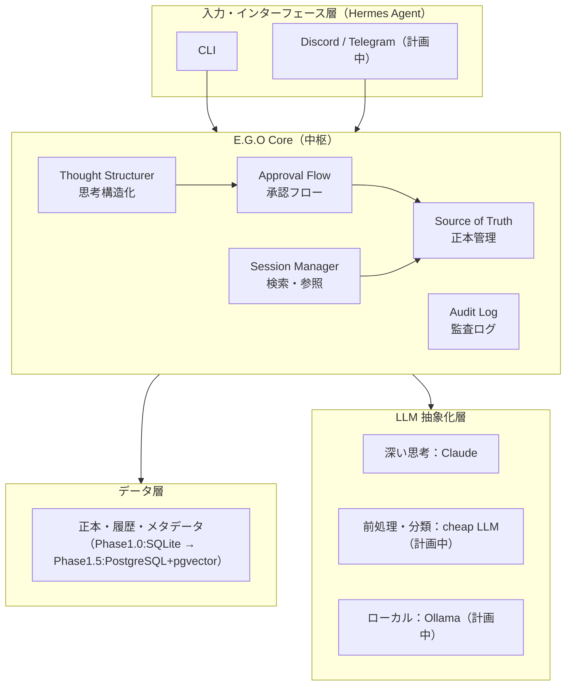
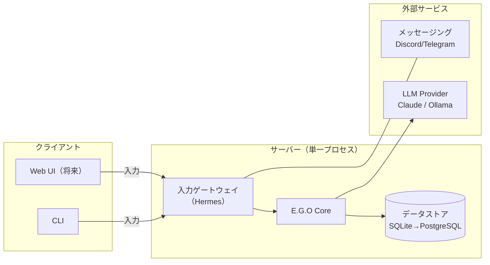
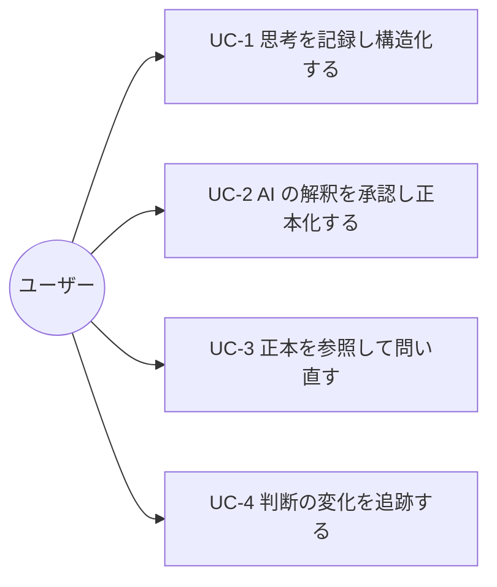
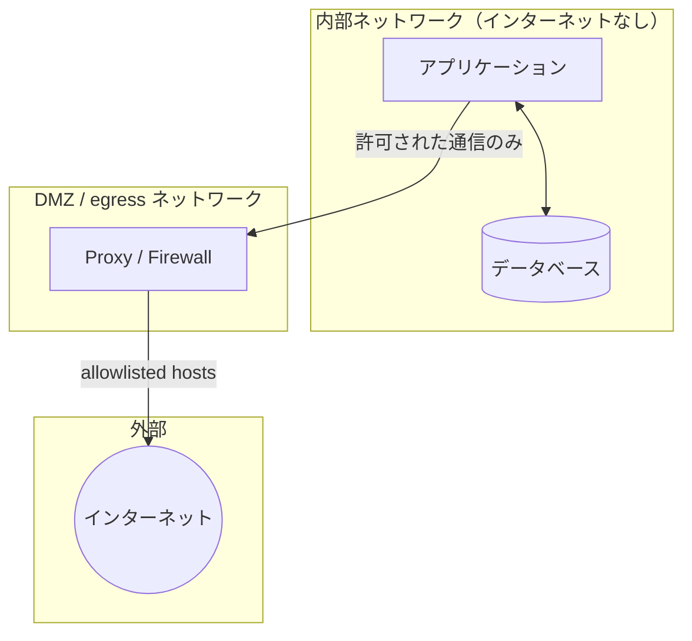

# E.G.O 基本設計書

## 文書情報

| 項目 | 内容 |
|---|---|
| 文書名 | E.G.O 基本設計書 |
| バージョン | 0.1（初版・設計フェーズ） |
| 作成日 | 2026-07-18 |
| 作成者 | 石井恭平 |
| 参照リポジトリ/URL | https://github.com/Kyo-arch-2026/ego-design |

## 改訂履歴

| 版 | 日付 | 変更内容 | 作成者 |
|---|---|---|---|
| 0.1 | 2026-07-18 | 初版作成（設計フェーズ。実装着手前） | 石井恭平 |

---

## 1. システム概要

### 1.1 システムの目的

E.G.O は、AI（人工知能）を使いながら「これは本当に自分の考えか、AI の解釈に置き換えられたものではないか」を確認できる、個人用 AI 基盤である。

AI を「自分の意思を増幅する鏡」ではなく「自分が思い込みに陥っていないかを確認する鏡」として位置づける。対話によって可視化された意思をその場限りで消えさせず記録として残し、判断がいつ・どのように変化したかを追跡可能にする。自我を定義するためのツールではなく、自我が自分のものであり続けることを確認するための装置である。

### 1.2 背景・動機

出発点は「自分が正しいと思い込んでいないか」という問いである。思い込みは、判断の変化を記録する仕組みがなければ気づけない。判断は記憶の中で薄れ、変質し、やがて「最初からそう思っていた」ことにすり替わる。

AI の利用は、この問題を深刻にした。AI は文脈を誤って記憶することがあり、何をどう覚えているかも確認しにくい。さらに AI の解釈と自分の考えが混ざると、両者の境界が曖昧になる。

同じ構造は他の場面にも現れる。銀行の監視業務ではベテランの判断基準がマニュアルに記載されず、本人の引退と共に消えていく。SNS では声の大きい人間の思い込みが他者の考えを侵食する。これらはすべて「判断の来歴が記録されず、それが本当に自分のものか確認できない」という一つの構造の異なる顔である。

便利さを手放すことは解決にならない。AI は便利で、便利でなければ人は能動的に動けない。ゆえに、便利に使いながら自分の考えと AI の解釈の境界を保てる仕組みが必要になる。これが E.G.O を設計する動機である。

> 詳細な背景は `docs/00-origin-story.md`、設計思想は `docs/01-philosophy.md` を参照。

### 1.3 適用範囲

本書は E.G.O 全体のシステム構成・機能・非機能要件・データ設計・運用方針の基本方針を対象とする。フェーズは以下のとおり区分する。

- **Phase 1.0（本書の主対象／実装予定）**：「思想が機能するか」を検証する最小実装。ストレージは SQLite で代替する。
- **Phase 1.5（計画中）**：PostgreSQL + pgvector への移行、Hermes Agent 統合、並列 cheap LLM 処理、認識可視化機能の拡充。
- **Phase 1.5 以降（課題）**：AI の解釈過程そのものの可視化。

本書作成時点で E.G.O は設計フェーズにあり、コードや動作する実装はまだ存在しない。GitHub 上の設計ドキュメントが唯一の成果物である。本書の状態表記は「設計がどこまで固まり、どこから実装・構想か」を示すものであり、動作状況を示すものではない。

### 1.4 前提条件・制約事項

- **個人利用が前提**：E.G.O は個人の判断データを扱う。データを手元に置く設計とし、当面は単一デバイスでの利用を想定する。
- **常駐コンポーネントを増やさない（原則3）**：機能追加時に新しいサービスや DB を増やさず、プラグインとして拡張する。DB は PostgreSQL に集約する。
- **LLM は補助役に徹する（原則2）**：最終判断は必ず人間が行う。AI が構造化した内容は、人間の承認を経て初めて正本になる。
- **特定プロバイダーに依存しない（原則2）**：LLM プロバイダーは抽象化層で切り替え可能にする。
- **技術的制約**：Phase 1.0 はベクトル検索を持たない（SQLite 代替のため）。ベクトル検索は pgvector 移行後の Phase 1.5 で導入する。
- **コスト制約**：不要な常駐コストを避けるため、個人開発段階ではクラウド常駐構成（AWS 等）を採用しない。将来、複数デバイス利用が必要になった場合は RDS（PostgreSQL）+ EC2/Lambda への移行パスを想定する。

---

## 2. システム構成

### 2.1 全体アーキテクチャ

E.G.O は「拡張型モジュラーモノリス + プラグインアーキテクチャ」を採用する。1 つのアプリケーションとしてシンプルに動作しながら、内部は機能ごとにモジュール化され、後から機能を追加しやすい構造を持つ。この方針は「常駐コンポーネントを増やさない」（原則3）に基づく。

### 2.2 レイヤー構成

| 層 | 役割 | 主要モジュール |
|---|---|---|
| 入力・インターフェース層 | ユーザーとの接点。入力受付とスキル実行 | Hermes Agent |
| E.G.O Core | 意志の保護・正本管理・文脈の蓄積 | Thought Structurer / Session Manager / Approval Flow / Source of Truth / Audit Log |
| データ層 | 正本・記憶・観測・原文の保持と検索 | PostgreSQL + pgvector / Valkey / Object Storage |
| LLM 抽象化層 | LLM プロバイダーに依存しない処理呼び出し | Claude / cheap LLM / Ollama |

### 2.3 主要コンポーネント

| コンポーネント | 概要 |
|---|---|
| Thought Structurer | 自由記述を「要約・課題・選択肢・次のアクション」に構造化する。出力は候補（candidate）であり、正本ではない。 |
| Session Manager | セッションで参照する正本を前面化し、AI に渡す情報の範囲を制御する。 |
| Approval Flow | AI の解釈（candidate）を人間が承認し、正本（active）へ昇格させる。原則2 の中核。 |
| Source of Truth | 正本を管理し、上書きせず状態遷移（candidate → active → superseded）として履歴を残す。E.G.O の核心。 |
| Audit Log | 全操作（登録・承認・状態遷移）を記録する。 |
| Hermes Agent | 入力・インターフェース層。Nous Research 製のオープンソース AI エージェント基盤を採用（Phase 1.5 統合）。 |

### 2.4 システム構成図

---

## 3. 機能要件

### 3.1 機能一覧

各機能の詳細な分解と状態は別紙「E.G.O 機能分解書」を正とする。本節はその要約である。状態凡例：🔨 実装予定（Phase 1.0）／📋 計画中（Phase 1.5 以降）。

| ID | 機能名 | 概要 | Phase | 優先度 |
|---|---|---|---|---|
| A | 入力・インターフェース | CLI 等からの入力受付と正規化 | 1.0（CLI）／1.5（多チャネル） | 高 |
| B | 思考構造化 | 自由記述を要約・課題・選択肢・次アクションへ構造化し候補登録 | 1.0 | 高 |
| C | 正本管理・状態遷移 | 正本テーブルと履歴テーブルを分離し、状態遷移で履歴を残す | 1.0（中核）／1.5（拡張） | 最高 |
| D | 承認フロー | 候補を人間が承認して正本化／却下 | 1.0 | 高 |
| E | 検索・参照 | SQL 絞り込み（1.0）とベクトル検索（1.5）で正本のみ返す | 1.0（SQL）／1.5（ベクトル） | 高 |
| F | 監査・履歴・可視化 | 全操作記録、参照フットプリント、履歴の三階層閲覧 | 1.0（監査ログ）／1.5（可視化） | 高 |

### 3.2 ユースケース

#### ユースケースシナリオ

**UC-1：思考を記録し構造化する**

1. ユーザーが漠然とした考えや迷いを自由記述で入力する。
2. Thought Structurer が「要約・課題・選択肢・次のアクション」に構造化し、元テキストを原文として保持する。
3. 構造化結果は候補（candidate）として登録され、正本にはまだ昇格しない。

**UC-2：AI の解釈を承認し正本化する**

1. E.G.O が候補（candidate）の内容をユーザーに提示する。
2. ユーザーが内容を確認し、承認または却下する。
3. 承認された候補は正本（active）へ昇格する。却下された候補は正本化されない。
4. 承認・却下の操作は監査ログに記録される。

**UC-3：正本を参照して問い直す**

1. ユーザーがある論点について E.G.O に問い合わせる。
2. E.G.O は（Phase 1.5 では）ベクトル検索で関連候補を広く想起し、SQL で `status='active'` かつ有効期限内のものへ収束させ、今有効な正本だけを参照する。
3. E.G.O は参照した正本の ID・タグ・状態を応答に添付する（参照フットプリント）。
4. ユーザーは「AI が何を正本として見て答えたか」を確認できる。

**UC-4：判断の変化を追跡する**

1. ユーザーがあるトピックの改訂履歴を開く。
2. E.G.O は要約ビュー（正本のみ）から、当該トピックの履歴（candidate / superseded を含む時系列）を段階的に展開して表示する。
3. ユーザーは判断がいつ・どのように変化したかを確認し、必要なら正本を修正する。

---

## 4. 非機能要件

| 区分 | 項目 | 要件 |
|---|---|---|
| 性能 | 入力・参照のレイテンシー | 普段使いに耐える応答速度を確保する。カード書き込み時間・正本参照時間・件数増加時の変化を測定できる仕組みを備え、実データに基づき型（カード型／トピック型）を確定する。 |
| セキュリティ | データの保持 | 個人の判断データは手元（ローカル）に保持する。外部送信は LLM 呼び出しに必要な最小限に留める。 |
| セキュリティ | ネットワーク分離 | 内部（アプリ＋DB）はインターネットに直接接続せず、許可された通信のみを Proxy/Firewall 経由の allowlist で外部へ出す構成を想定する。 |
| 可用性 | 単一障害の許容 | 個人利用のため高可用性は必須としない。データ損失を防ぐバックアップを優先する。 |
| 保守性 | プロバイダー非依存 | LLM は抽象化層で切り替え可能とし、特定企業へのロックインを避ける（原則2）。 |
| 保守性 | 監査可能性 | 全操作を監査ログに記録し、判断の来歴を後から追える状態を保つ（原則1）。 |
| 拡張性 | プラグイン拡張 | 機能追加は常駐コンポーネントを増やさず、プラグインとして行う（原則3）。 |

---

## 5. データ設計概要

E.G.O のデータ設計は「情報に時間軸を持たせ、常に今有効な正本だけを参照する」ことを核とする。既存の LLM が過去の情報をフラットに扱い古い判断もそのまま参照してしまう問題を、状態遷移によって解決する。

正本管理では、AI が参照する正本と人間が管理する履歴を物理的に分離する。正本テーブル（`canonical_facts`）は `active` のみを保持する小さいテーブルとし、AI とベクトル検索が参照する対象を限定してハルシネーションを抑える。履歴テーブル（`fact_revisions`）は candidate / superseded / invalid / archived を保持する追記専用ログとし、人間の追跡性を担保する。基本単位は事実カード型（1 判断＝1 カード）とし、トピック型の見え方はタグとビューで後付けする。

> データ定義・状態遷移・関連図の詳細は「E.G.O 詳細設計書」を参照。

### 5.1 データ層構成

| 層 | 役割 |
|---|---|
| Canonical Layer（正本層） | 最終的に信じる情報。`status='active'` の正本。 |
| Memory Layer（記憶層） | 中長期の記憶。 |
| Observation Layer（観測層） | 外部ソースからの観測。 |
| Raw Evidence Layer（原文層） | 復元・監査のための元データ（構造化前の原文を含む）。 |

### 5.2 ストレージ構成

| ストレージ | 役割 |
|---|---|
| SQLite（Phase 1.0） | Phase 1.0 での正本・履歴・監査ログの代替ストレージ。 |
| PostgreSQL + pgvector（Phase 1.5〜） | 正本・記憶・メタデータの保持、全文検索・ベクトル検索。書き込みの信頼性（ACID）を確保。 |
| Valkey（Phase 1.5〜） | セッションキャッシュ・短期状態。 |
| Object Storage（Phase 1.5〜） | 原文（raw HTML・PDF・会話原文）の保持。 |

---

## 6. インターフェース設計

### 6.1 入力インターフェース

| インターフェース | 用途 | Phase |
|---|---|---|
| CLI（コマンドライン） | Phase 1.0 の主入力。思考記録・承認・参照 | 1.0 |
| Discord | メッセージング経由の入力 | 1.5 |
| Telegram | メッセージング経由の入力 | 1.5 |
| 音声メモ文字起こし | 音声からの入力 | 1.5 |

### 6.2 外部システム連携

| 連携先 | 用途 | 備考 |
|---|---|---|
| Claude | 深い思考・handoff。長文・思想的議論 | LLM 抽象化層経由 |
| cheap LLM | 前処理・分類（並列） | Phase 1.5。コスト・速度のバランス |
| Ollama | ローカル実行 | Phase 1.5。プライバシー・オフライン対応 |
| Hermes Agent | 入力・インターフェース基盤 | Phase 1.5 統合。セッション記憶・プロバイダー非依存 |

---

## 7. 運用設計

### 7.1 デプロイ構成

Phase 1.0 はローカル単一プロセスで動作させる。個人利用・単一デバイスを前提とし、クラウド常駐構成は採用しない。将来、複数デバイス利用が必要になった場合は RDS（PostgreSQL）+ EC2/Lambda への移行を想定する（不要な常駐コストを避けるコスト合理性に基づく判断）。

### 7.2 ネットワークセキュリティ構成

個人の判断データを扱うため、内部ネットワーク（アプリケーション＋データベース）はインターネットに直接接続しない。外部通信は許可された通信のみを Proxy/Firewall 経由で許可し、接続先を allowlist で限定する。

### 7.3 バックアップ

個人利用のため可用性より**データ損失防止**を優先する。正本テーブルと履歴テーブル、監査ログを定期的にバックアップする。追記専用の履歴テーブルにより、誤操作からの復元性を確保する。具体的な方式・頻度は実装フェーズで確定する。

### 7.4 ログ・監視

全操作（登録・承認・状態遷移）を監査ログ（Audit Log）として記録する。これは運用監視のためだけでなく、「判断の来歴を残す」という E.G.O の設計原則1 そのものの実装でもある。

---

## 8. 関連文書

| 文書名 | URL/パス | 概要 |
|---|---|---|
| Origin Story | `docs/00-origin-story.md` | なぜ E.G.O を作ったか |
| Philosophy | `docs/01-philosophy.md` | 4 つの設計原則 |
| Architecture | `docs/02-architecture.md` | システム設計 |
| External Tools | `docs/04-external-tools.md` | 外部ツール選定 |
| E.G.O 機能分解書 | （別紙） | 機能の階層的分解と状態 |
| E.G.O 詳細設計書 | （別紙・作成予定） | モジュール・データ・IF の詳細 |

---

## 9. 用語集

| 用語 | 定義 |
|---|---|
| E.G.O | 本システム。自我が自分のものであり続けることを確認するための個人用 AI 基盤。 |
| 正本（Source of Truth / canonical） | 最終的に信じる、今有効な情報。`status='active'` のもの。 |
| candidate（候補） | AI が構造化した、まだ承認されていない情報。正本ではない。 |
| active（有効） | 人間の承認を経て正本になった状態。 |
| superseded（置換済） | 新しい正本に置き換えられた、過去の正本。履歴として保持される。 |
| 参照フットプリント | AI 応答に添付される、参照した正本の ID・タグ・状態の記録。 |
| Thought Structurer | 自由記述を構造化するモジュール。 |
| Approval Flow | 候補を人間が承認し正本化する仕組み。 |
| Hermes Agent | 入力・インターフェース層に採用する、Nous Research 製のオープンソース AI エージェント基盤。 |
| pgvector | PostgreSQL でベクトル検索を可能にする拡張。Phase 1.5 で導入。 |
| LLM | 大規模言語モデル（Large Language Model）。 |
| CLI | コマンドラインインターフェース（Command Line Interface）。 |
