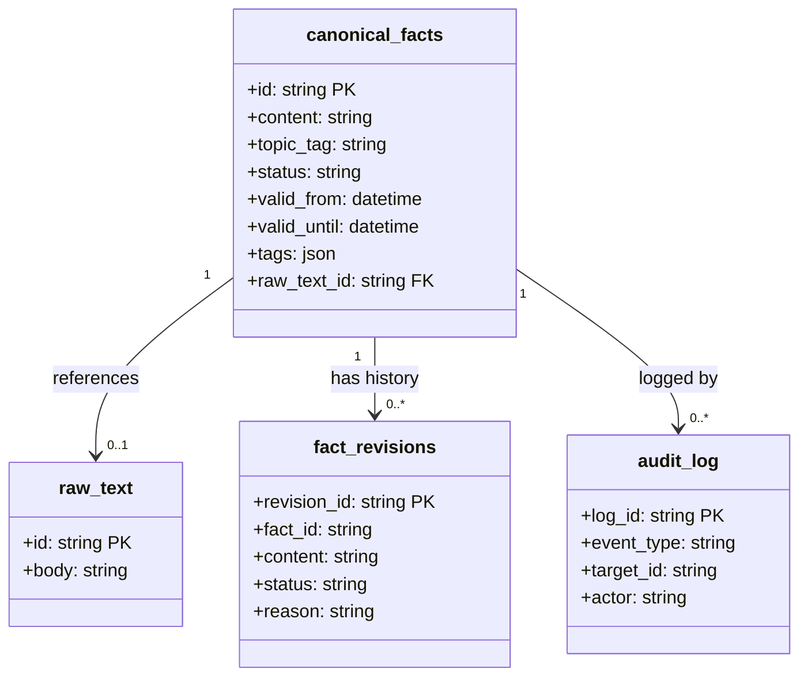
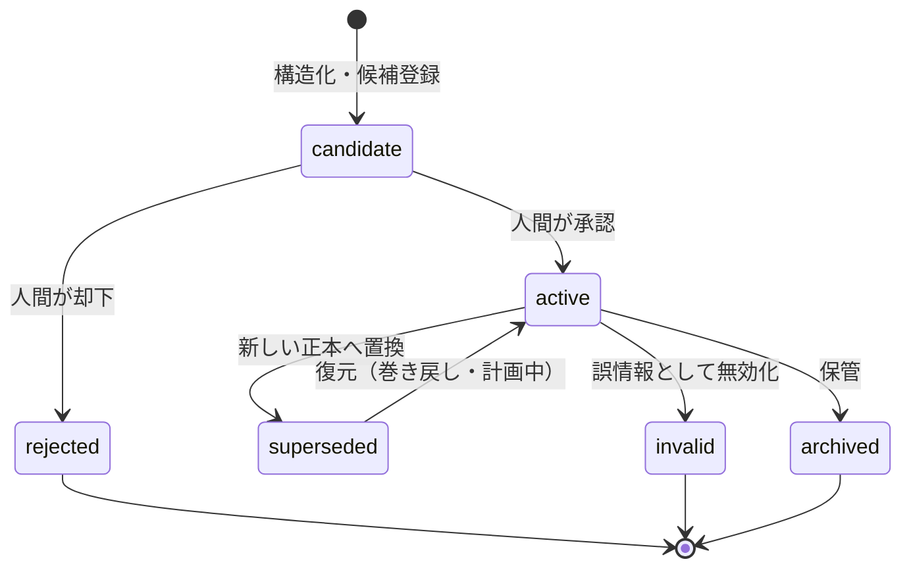
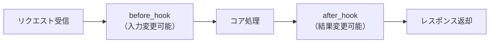

# E.G.O 詳細設計書

## 文書情報

| 項目 | 内容 |
|---|---|
| 文書名 | E.G.O 詳細設計書 |
| バージョン | 0.1（初版・設計フェーズ） |
| 作成日 | 2026-07-18 |
| 作成者 | 石井恭平 |
| 参照リポジトリ/URL | https://github.com/Kyo-arch-2026/ego-design |

## 改訂履歴

| 版 | 日付 | 変更内容 | 作成者 |
|---|---|---|---|
| 0.1 | 2026-07-18 | 初版作成（設計フェーズ。実装着手前） | 石井恭平 |

> 本書作成時点で E.G.O は設計フェーズにあり、コードや動作する実装はまだ存在しない。本書の記述は Phase 1.0（SQLite 代替）で実装予定の設計であり、パス・型・フィールド名は実装時に変わりうる暫定案を含む。状態凡例：🔨 実装予定（Phase 1.0）／📋 計画中（Phase 1.5 以降）。

---

## 1. モジュール設計

### 1.1 モジュール一覧

「対応要件」列は「E.G.O 機能分解書」の機能 ID を指し、機能分解書と本書のトレーサビリティを確保する。パスは Phase 1.0 の暫定構成案。

| モジュール名 | パス（暫定） | 役割 | 対応要件 |
|---|---|---|---|
| Input Gateway | `ego/input/` | CLI からの入力受付と正規化 | A-1, A-6 |
| Thought Structurer | `ego/core/structurer/` | 自由記述を要約・課題・選択肢・次アクションへ構造化し候補登録 | B-1〜B-6 |
| Approval Flow | `ego/core/approval/` | 候補の提示・承認・却下・承認記録 | D-1〜D-3, D-5 |
| Source of Truth | `ego/core/sot/` | 正本・履歴の管理と状態遷移 | C-1-1〜C-1-3, C-1-5, C-1-6, C-2-1, C-2-2 |
| Session Manager | `ego/core/session/` | 参照範囲制御・文脈前面化・SQL 絞り込み | E-2, E-4, E-5 |
| Audit Log | `ego/core/audit/` | 全操作の記録 | F-1 |
| LLM Adapter | `ego/llm/` | LLM プロバイダー抽象化 | （原則2 基盤） |
| Store | `ego/store/` | 永続化層（Phase 1.0: SQLite） | C 層全般の基盤 |

### 1.2 各モジュール詳細

#### Input Gateway

- **責務**：CLI からユーザー入力を受け取り、Core が扱える内部形式に正規化する。Phase 1.0 では CLI のみを対象とする。
- **入力**：ユーザーの自由記述テキスト、コマンド（記録・承認・参照・履歴閲覧）。
- **出力**：正規化された入力オブジェクト（本文、コマンド種別、タイムスタンプ）。
- **処理フロー**：入力受信 → コマンド種別を判定 → 本文を正規化 → 対応する Core モジュールへ委譲。

#### Thought Structurer

- **責務**：自由記述を「要約・課題・選択肢・次のアクション」に構造化する。構造化前の原文を保持する。出力は候補（candidate）であり、正本に自動昇格させない（原則2）。
- **入力**：正規化された自由記述テキスト。
- **出力**：構造化結果（要約・課題・選択肢・次アクション）＋原文。candidate 状態で Source of Truth へ登録。
- **処理フロー**：原文を保存 → LLM Adapter 経由で構造化を依頼 → 結果を candidate として Source of Truth に登録 → Approval Flow へ承認を要求。

#### Approval Flow

- **責務**：候補（candidate）を人間に提示し、承認または却下を受け付ける。結果を監査ログに記録する。原則2 の中核。
- **入力**：candidate レコード、ユーザーの承認／却下操作。
- **出力**：承認時は Source of Truth へ active 昇格を指示。却下時は candidate を却下状態に。いずれも Audit Log へ記録。
- **処理フロー**：candidate を提示 → ユーザー操作を待つ → 承認なら active 昇格を指示／却下なら却下記録 → Audit Log へ記録。

#### Source of Truth

- **責務**：正本と履歴を分離管理し、状態遷移として履歴を残す（上書きしない）。E.G.O の核心。
- **入力**：candidate 登録要求、active 昇格要求、置換要求。
- **出力**：`canonical_facts`（正本）と `fact_revisions`（履歴）への更新。
- **処理フロー**：後述「4.1 主要処理フロー」を参照。

#### Session Manager

- **責務**：セッションで AI に渡す正本の範囲を制御する。Phase 1.0 では SQL による絞り込みで「今有効な正本だけ」を返す。
- **入力**：問い合わせ、参照文脈。
- **出力**：`status='active'` かつ有効期限内に絞り込まれた正本の集合。
- **処理フロー**：（Phase 1.5 ではベクトル検索で候補を想起 →）SQL で active かつ有効期限内に収束 → 参照集合を返す。

#### Audit Log

- **責務**：全操作（登録・承認・却下・状態遷移）を追記専用で記録する（原則1）。
- **入力**：操作イベント（種別、対象 ID、実行者、時刻）。
- **出力**：`audit_log` への追記。

#### LLM Adapter

- **責務**：LLM プロバイダーを抽象化し、呼び出し側がプロバイダーを意識しないようにする（原則2）。
- **入力**：プロンプト、用途種別（深い思考／前処理）。
- **出力**：LLM 応答。Phase 1.0 は単一プロバイダー（Claude）、Phase 1.5 で cheap LLM・Ollama を追加。

### 1.3 主要処理フロー

システム全体の主要な流れは「入力 → 構造化（候補生成）→ 承認 → 正本化 → 参照」である。詳細は 4.1 に記す。

---

## 2. データ設計

### 2.1 データ構成一覧

| データ名 | 形式 | 目的 |
|---|---|---|
| canonical_facts | RDB テーブル | 今有効な正本（active のみ）を保持。AI・検索の参照対象 |
| fact_revisions | RDB テーブル（追記専用） | candidate / superseded / invalid / archived の全履歴を保持 |
| audit_log | RDB テーブル（追記専用） | 全操作の監査記録 |
| raw_text | RDB テーブル（Phase 1.5 で Object Storage へ） | 構造化前の原文 |

> 形式は Phase 1.0 では SQLite のテーブル。Phase 1.5 で PostgreSQL へ移行し、raw_text は Object Storage に分離する。

### 2.2 データ定義

#### canonical_facts（正本テーブル）

`active` の正本のみを保持する。テーブルを小さく保つことで AI 参照時の曖昧さを抑える。

| フィールド | 型 | 制約 | 説明 |
|---|---|---|---|
| id | TEXT (UUID) | PK | カードの一意 ID。参照フットプリントで使用 |
| content | TEXT | NOT NULL | 判断・結論の本文 |
| topic_tag | TEXT | NULL 可 | トピック束ね用タグ（後付けグルーピング。📋 計画中） |
| status | TEXT | NOT NULL, CHECK('active') | 正本テーブルでは常に active |
| valid_from | DATETIME | NOT NULL | 有効開始 |
| valid_until | DATETIME | NULL 可 | 有効終了（NULL は現時点で有効） |
| tags | TEXT (JSON) | NULL 可 | 自由タグ（検索・絞り込み用） |
| raw_text_id | TEXT | FK → raw_text.id, NULL 可 | 構造化元の原文への参照 |
| created_at | DATETIME | NOT NULL | 作成時刻 |
| updated_at | DATETIME | NOT NULL | 更新時刻 |

#### fact_revisions（履歴テーブル・追記専用）

candidate を含む全状態の改訂を時系列で保持する。append-only とし、上書き・削除しない。

| フィールド | 型 | 制約 | 説明 |
|---|---|---|---|
| revision_id | TEXT (UUID) | PK | 改訂の一意 ID |
| fact_id | TEXT | NOT NULL, INDEX | 対応するカード ID（canonical_facts.id と対応） |
| content | TEXT | NOT NULL | その時点の本文 |
| status | TEXT | NOT NULL | candidate / superseded / invalid / archived |
| reason | TEXT | NULL 可 | 状態が変わった理由（📋 計画中） |
| topic_tag | TEXT | NULL 可 | トピックタグ |
| valid_from | DATETIME | NULL 可 | 有効開始 |
| valid_until | DATETIME | NULL 可 | 有効終了 |
| created_at | DATETIME | NOT NULL | 改訂記録時刻 |

#### audit_log（監査ログ・追記専用）

| フィールド | 型 | 制約 | 説明 |
|---|---|---|---|
| log_id | TEXT (UUID) | PK | ログの一意 ID |
| event_type | TEXT | NOT NULL | register / approve / reject / transition |
| target_id | TEXT | NOT NULL | 対象カード ID |
| actor | TEXT | NOT NULL | 実行者（human / system） |
| detail | TEXT (JSON) | NULL 可 | 補足情報 |
| created_at | DATETIME | NOT NULL | 記録時刻 |

### 2.3 データ関連図

---

## 3. インターフェース・プロトコル設計

### 3.1 インターフェース一覧

| 種別 | 名前 | 概要 |
|---|---|---|
| CLI | `ego record` | 自由記述を入力し構造化・候補登録する |
| CLI | `ego approve <id>` | 候補を承認して正本化する |
| CLI | `ego reject <id>` | 候補を却下する |
| CLI | `ego ask <query>` | 正本を参照して問い合わせる |
| CLI | `ego history <topic>` | トピックの改訂履歴を表示する |
| RPC（内部） | Core モジュール間呼び出し | 構造化・承認・正本化・参照の内部連携 |
| Plugin（将来） | 拡張ポイント | 常駐を増やさず機能を追加する（📋 計画中） |

### 3.2 インターフェース詳細

#### `ego record`

- **プロトコル/メソッド**：CLI コマンド。
- **リクエスト/入力**：自由記述テキスト（標準入力または引数）。
- **レスポンス/出力**：構造化結果（要約・課題・選択肢・次アクション）と、登録された candidate の ID。承認待ちであることを表示。

#### `ego approve <id>`

- **プロトコル/メソッド**：CLI コマンド。
- **リクエスト/入力**：承認対象の candidate ID。
- **レスポンス/出力**：active へ昇格した正本の ID と内容。既存の同トピック正本があれば superseded へ退避したことを表示。

#### `ego ask <query>`

- **プロトコル/メソッド**：CLI コマンド。
- **リクエスト/入力**：問い合わせ文。
- **レスポンス/出力**：参照した正本に基づく応答＋参照フットプリント（正本 ID・タグ・状態）。フットプリントは F-5（📋 計画中）で本格化。

---

## 4. 処理フロー設計

### 4.1 主要処理フロー：記録から正本化まで

1. ユーザーが `ego record` で自由記述を入力する。
2. Input Gateway が正規化し、Thought Structurer へ渡す。
3. Thought Structurer が原文を `raw_text` に保存し、LLM Adapter 経由で構造化する。
4. 構造化結果を candidate として `fact_revisions` に記録する（この時点で正本ではない）。
5. Approval Flow が candidate をユーザーに提示する。
6. ユーザーが承認すると、Source of Truth が以下を行う。
   - 同一トピックに既存の active 正本があれば、それを superseded として `fact_revisions` に退避し、`canonical_facts` から除く。
   - 新しい内容を active として `canonical_facts` に登録する。
7. Audit Log が一連の操作（register / approve / transition）を記録する。
8. 却下の場合、candidate は正本化されず、却下が Audit Log に記録される。

### 4.2 状態遷移

正本は直接上書きせず、状態を遷移させる。

| 現在状態 | イベント | 次状態 | 実行者 |
|---|---|---|---|
| （なし） | 構造化・候補登録 | candidate | system |
| candidate | 承認 | active | human |
| candidate | 却下 | rejected | human |
| active | 新正本へ置換 | superseded | human（承認起点） |
| active | 無効化（📋 計画中） | invalid | human |
| active | 保管（📋 計画中） | archived | human |
| superseded | 復元（📋 計画中） | active | human |

---

## 5. プラグイン・拡張設計

E.G.O は「常駐コンポーネントを増やさない」（原則3）ため、機能追加を新サービスではなくプラグインとして行う。Phase 1.0 では拡張機構の骨格のみを設計し、実装は Phase 1.5 以降とする（📋 計画中）。

### 5.1 拡張ポイント一覧

| 拡張種別 | 名前 | 発生タイミング | 可能な操作 |
|---|---|---|---|
| Middleware | 入力前処理フック | 入力受付直後 | 入力の変換・検証 |
| Plugin Hook | 構造化後フック | candidate 生成後 | 構造化結果の補正・タグ付与 |
| Observer Hook | 状態遷移フック | 状態遷移時 | 通知・外部連携 |
| Event Handler | 監査イベント | Audit Log 記録時 | 外部ログ連携 |

### 5.2 拡張インターフェース詳細

各拡張ポイントは「入力・出力・制約」を持つ。コア処理の前後にフックを挟み、コアの責務を汚さずに機能を足す。

#### フック実行順序

---

## 6. エラー処理設計

### 6.1 エラー分類

| 区分 | コード/ステータス | 例 | 対応 |
|---|---|---|---|
| 入力エラー | E_INPUT | 空入力、未知コマンド | ユーザーに再入力を促す |
| 承認エラー | E_APPROVAL | 存在しない candidate ID の承認 | 該当なしを通知 |
| 状態遷移エラー | E_STATE | 不正な遷移（例：rejected を active 化） | 遷移を拒否しログ記録 |
| LLM エラー | E_LLM | プロバイダー応答失敗・タイムアウト | リトライ、または原文を保持し構造化を保留 |
| 永続化エラー | E_STORE | 書き込み失敗 | トランザクションをロールバックし整合性を保つ |

### 6.2 エラーレスポンス形式

CLI ではエラーコード・原因・推奨アクションを一貫した形式で表示する（例：`[E_INPUT] 入力が空です。記録する内容を入力してください`）。永続化エラー時は正本・履歴の整合性を最優先し、中途半端な状態を残さない。

---

## 7. セキュリティ設計

| 項目 | 方針 |
|---|---|
| データ保持 | 個人の判断データはローカルに保持。外部送信は LLM 呼び出しに必要な最小限に限定 |
| 外部通信 | 内部（アプリ＋DB）はインターネットに直接接続せず、Proxy/Firewall 経由の allowlist で限定（基本設計書 7.2 を参照） |
| 監査 | 全操作を追記専用の Audit Log に記録し、事後追跡を可能にする（原則1） |
| LLM 送信内容 | 構造化のため LLM に送るテキストは、送信範囲を Session Manager が制御する |

---

## 8. デプロイ・環境設計

デプロイ方針・ネットワーク構成は基本設計書「7. 運用設計」を正とする。本書では設定・構成管理のみ扱い、重複を避ける。

### 8.1 設定・構成管理

- 設定は設定ファイル＋環境変数で管理する。LLM プロバイダーの切り替え（Claude / cheap LLM / Ollama）は設定値で行い、コード変更を不要にする（原則2）。
- 秘密情報（API キー等）は環境変数で注入し、リポジトリに含めない。
- Phase 1.0 はローカル単一プロセス、ストレージは SQLite ファイル。Phase 1.5 で PostgreSQL 接続設定へ切り替える。

---

## 9. テスト設計

### 9.1 テスト方針

| レベル | 対象 | ツール（暫定） |
|---|---|---|
| 単体テスト | 各モジュールのロジック（構造化・状態遷移・絞り込み） | pytest（想定） |
| 統合テスト | 記録→承認→正本化→参照の一連フロー | pytest（想定） |
| E2E テスト | CLI コマンド経由の一連操作 | CLI 実行ベースのテスト（想定） |

> テストツールは Phase 1.0 実装時に確定する暫定案。

### 9.2 テストケース一覧

| ID | テスト内容 | 期待結果 |
|---|---|---|
| T-1 | 自由記述を record し candidate が生成される | fact_revisions に candidate が 1 件記録される |
| T-2 | candidate を approve する | canonical_facts に active が 1 件登録される |
| T-3 | 既存 active があるトピックで新正本を approve する | 旧正本が superseded へ退避し、新正本が active になる |
| T-4 | candidate を reject する | 正本化されず、Audit Log に reject が記録される |
| T-5 | ask で参照する | status='active' のみが参照され、superseded は参照されない |
| T-6 | 不正な状態遷移を試みる | E_STATE で拒否され、状態が変化しない |
| T-7 | 全操作後に audit_log を確認する | register / approve / transition が時系列で記録される |

---

## 付録：主要な設計判断の根拠（Design Decisions）

E.G.O は「なぜその選択か／なぜ他ではないか」を明示する方針（外部ツール選定と同じ姿勢）を、実装判断にも適用する。

| # | 判断 | 選んだ理由 | 退けた案とその理由 |
|---|---|---|---|
| DD-1 | 正本テーブルと履歴テーブルを分離 | 正本を小さく保ち AI 参照時の曖昧さ・ハルシネーションを抑えつつ、履歴を完全保存して人間の追跡性を担保する | 単一テーブルに全状態を混在：AI も人間も情報過多で溺れる |
| DD-2 | 事実カード型（1 判断＝1 カード）で開始 | 普段使いの入力は単発の粒で発生し摩擦が少ない。カードを主キーにすればトピック型へ後付けで束ねられる | トピック型で開始：主キーを粗くすると後で細かくできず後戻りになる |
| DD-3 | トピック型はタグ＋ビューで後付け | テーブル構造を変えずにトピック型の見え方を得られる | 最初からトピック構造を固定：利便性と将来の柔軟性を損なう |
| DD-4 | ベクトル検索 →SQL の順で収束 | ベクトルで広く想起し、SQL で active・有効期限内に機械的に絞ることで「今有効な正本だけ」を保証する | SQL→ベクトルの順／ベクトルのみ：古い情報や候補を拾いハルシネーションの温床になる |
| DD-5 | Phase 1.0 は SQLite で代替 | 「思想が機能するか」の検証が目的。ベクトル検索なしでも SQL 絞り込みで正本参照は成立する | 最初から PostgreSQL+pgvector：セットアップ負荷が高く、動くものの完成が遠のく |
| DD-6 | 履歴閲覧を三階層（要約→トピック履歴→監査ログ） | 情報過多で人間が管理できない問題への回答。日常は要約ビューだけを見せ、深掘りは段階的に開く | 全履歴を一度に表示：使用者が確認できる量を超え、管理不能になる |
| DD-7 | 承認前修正（D-4）は Phase 1.5 送り | Phase 1.0 は承認／却下の二択を先に固め、動く最小を優先する | Phase 1.0 で修正まで実装：範囲が広がり検証が遅れる |

> 用語（candidate / active / superseded、正本、参照フットプリント等）の定義は基本設計書「9. 用語集」を参照。
