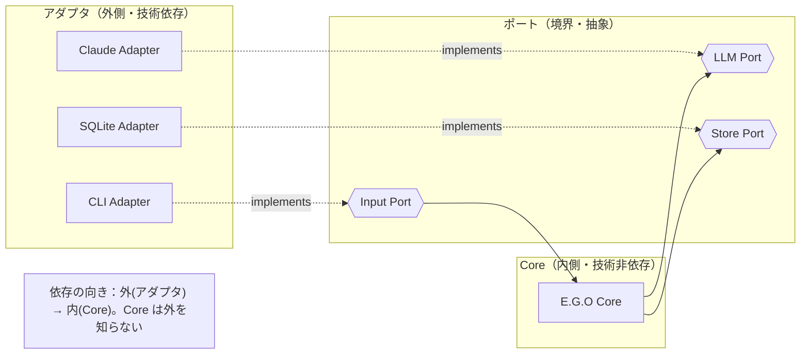
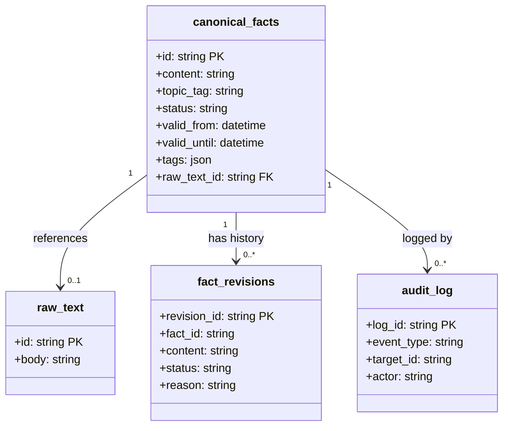
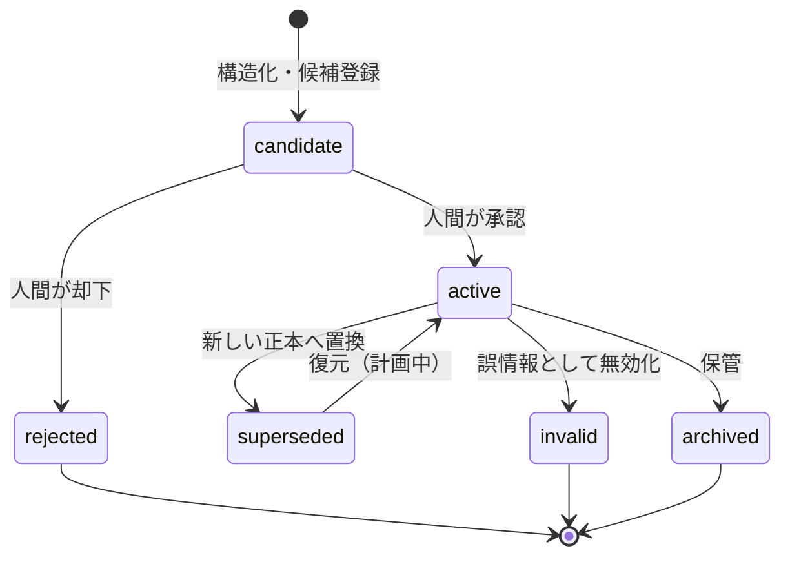
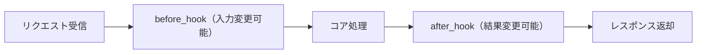

# E.G.O 詳細設計書

## 文書情報

| 項目 | 内容 |
|---|---|
| 文書名 | E.G.O 詳細設計書 |
| バージョン | 0.2（疎結合アーキテクチャ反映版） |
| 作成日 | 2026-07-18 |
| 作成者 | 石井恭平 |
| 参照リポジトリ/URL | https://github.com/Kyo-arch-2026/ego-design |

## 改訂履歴

| 版 | 日付 | 変更内容 | 作成者 |
|---|---|---|---|
| 0.1 | 2026-07-18 | 初版作成（設計フェーズ。実装着手前） | 石井恭平 |
| 0.2 | 2026-07-18 | 入力・LLM・ストレージの抽象ポート設計を追加。実装者向けのポート設計規約を明記 | 石井恭平 |

> 本書作成時点で E.G.O は設計フェーズにあり、コードや動作する実装はまだ存在しない。本書は Phase 1.0 で実装予定の設計であり、パス・型・フィールド名は実装時に変わりうる暫定案を含む。状態凡例：🔨 実装予定（Phase 1.0）／📋 計画中（Phase 1.5 以降）。

---

## 1. モジュール設計

### 1.1 モジュール一覧

「対応要件」列は「E.G.O 機能分解書」の機能 ID を指す。

| モジュール名 | パス（暫定） | 役割 | 対応要件 |
|---|---|---|---|
| Input Port | `ego/ports/input_port.py` | 入力の抽象インターフェース | G-1 |
| CLI Adapter | `ego/adapters/input/cli/` | Input Port の Phase 1.0 実装 | A-1, A-5 |
| Thought Structurer | `ego/core/structurer/` | 構造化・候補登録。LLM Port 経由で LLM を呼ぶ | B-1〜B-6 |
| Approval Flow | `ego/core/approval/` | 候補の提示・承認・却下・記録 | D-1〜D-3, D-5 |
| Source of Truth | `ego/core/sot/` | 正本・履歴の管理と状態遷移。Store Port 経由で永続化 | C-1-1〜C-1-3, C-1-5, C-1-6, C-2-1, C-2-2 |
| Session Manager | `ego/core/session/` | 参照範囲制御・SQL 絞り込み。Store Port 経由 | E-2, E-4, E-5 |
| Audit Log | `ego/core/audit/` | 全操作の記録。Store Port 経由 | F-1 |
| LLM Port | `ego/ports/llm_port.py` | LLM 呼び出しの抽象インターフェース | G-2 |
| Claude Adapter | `ego/adapters/llm/claude/` | LLM Port の Phase 1.0 実装 | G-6 |
| Store Port | `ego/ports/store_port.py` | 永続化・検索の抽象インターフェース | G-3 |
| SQLite Adapter | `ego/adapters/store/sqlite/` | Store Port の Phase 1.0 実装 | G-4 |

> Core（`ego/core/`）は `ego/ports/` のみを import してよい。`ego/adapters/` を Core が直接 import してはならない（1.4 の規約を参照）。

### 1.2 各モジュール詳細（抜粋）

#### Thought Structurer
- **責務**：自由記述を要約・課題・選択肢・次アクションに構造化。原文を保持。出力は candidate。
- **入力**：正規化された入力オブジェクト（Input Port から受領）。
- **出力**：candidate レコード（Store Port 経由で保存）。
- **依存**：LLM Port（構造化のため）、Store Port（保存のため）。**具体アダプタには依存しない。**

#### Source of Truth
- **責務**：正本と履歴を分離管理し、状態遷移として履歴を残す。E.G.O の核心。
- **入力**：candidate 登録要求、active 昇格要求、置換要求。
- **出力**：Store Port 経由での `canonical_facts`／`fact_revisions` 更新。
- **依存**：Store Port のみ。**SQLite・SQL 文字列を直接扱ってはならない。**

（他モジュールの責務は 0.1 版から不変。省略分は機能分解書と対応要件を参照）

### 1.3 主要処理フロー

「入力（アダプタ→Input Port）→ 構造化（候補生成）→ 承認 → 正本化（Store Port 経由）→ 参照」。詳細は 4.1。

### 1.4 抽象化ポートの設計規約 ★実装者は必読

本節は、実装を担当する者が**抽象インターフェースの切り方を誤らないため**の規約である。E.G.O の疎結合・手間削減・障害切り分けは、この規約を守ることで初めて成立する。規約を破ると、後からの技術差し替え（例：SQLite→PostgreSQL）が「散らばった依存を剥がす作り直し」に化け、E.G.O の思想（手間を減らす）が崩れる。

#### 規約1：依存の向きは常に「アダプタ → ポート → Core」

- Core（`ego/core/`）は `ego/ports/` の抽象インターフェースだけを知る。
- アダプタ（`ego/adapters/`）がポートを実装（適合）する。
- **Core からアダプタへの import は禁止。** 依存の矢印が Core からアダプタへ向くと、Core が具体技術を知ってしまい疎結合が壊れる。
- **理由**：この一方向を守る限り、アダプタ（外部技術）が何に変わっても Core は無傷。障害もアダプタ側に限局する。

#### 規約2：ポートは「E.G.O の概念」で語り、「技術の言葉」を漏らさない

これが最も間違えやすい点である。ポートのメソッド・引数・戻り値には、**背後の技術に固有の語彙を一切登場させない。**

- **Store Port の良い例**：`save_candidate(fact)` / `promote_to_active(fact_id)` / `supersede(old_id, new_fact)` / `find_active_by_topic(topic_tag)` / `append_audit(event)`。引数・戻り値は E.G.O のドメイン型（Fact, Revision, AuditEvent）。
- **Store Port の悪い例（禁止）**：`execute_sql(query)` / `get_connection()` / `run_query(...)` のように SQL・接続・カーソルなど**ストレージ技術の語彙が出てくるもの**。これらは SQLite/PostgreSQL の都合であり、ポートに漏らすと Core が特定技術に縛られる。
- **LLM Port の良い例**：`structure(text) -> StructuredThought` のように用途で語る。
- **LLM Port の悪い例（禁止）**：`call_claude(prompt)` のようにプロバイダー名や API の細部が出るもの。
- **Input Port の良い例**：アダプタが `InputMessage`（正規化済み）を Core に渡す。
- **Input Port の悪い例（禁止）**：Discord の Message オブジェクトや CLI の argv をそのまま Core へ渡すこと。
- **理由**：ポートが技術語彙を含んだ瞬間、そのポートは特定技術専用になり、差し替え不能になる。ポートは「E.G.O が何をしたいか」だけを表現し、「どう実現するか」はアダプタに閉じる。

#### 規約3：ドメイン型はポートの内側（Core 側）で定義する

- Fact / Revision / StructuredThought / AuditEvent / InputMessage などの型は Core 側で定義し、ポート・アダプタはこれを介してやり取りする。
- アダプタは「外部技術の型 ↔ ドメイン型」の変換だけを担う（例：SQLite の row → Fact）。
- **理由**：ドメイン型が技術側に定義されると、技術を変えたとき型ごと作り直しになる。

#### 規約4：Phase 1.0 の実装範囲（2-a 方針）

- Phase 1.0 では **3 つのポート（Input/LLM/Store）を定義**し、それぞれ **1 つのアダプタ（CLI/Claude/SQLite）だけ**を実装する。
- **PostgreSQL アダプタや Discord アダプタは Phase 1.0 では作らない。** 作るのは「ポートという口」と「今使う 1 アダプタ」だけ。
- ただし SQLite アダプタを実装する際も、規約1〜3 を必ず守る。すなわち **Core は SQLite を一切直接触らず、Store Port 経由でのみ永続化する。**
- **理由（重要）**：この規約4 を守れば、Phase 1.5 の PostgreSQL 移行は「PostgreSQL アダプタを 1 個追加し、起動時に差し込むアダプタを切り替える」だけで完了し、Core・Source of Truth・Session Manager を一行も改修しない。逆に規約を破って Core に SQL を散らすと、移行時に全 Core を作り直すことになる。「一度普通に実装して後から抽象化」を避け、最初からポート経由にするのはこのためである。

#### 規約5：アダプタの差し込みは起動時に一箇所で行う（依存性注入）

- どのアダプタを使うかは、アプリ起動時の構成（設定ファイル／環境変数）で決め、一箇所で Core に注入する。
- Core は注入されたポート実装を使うだけで、どのアダプタかを判定するコードを持たない。
- **理由**：アダプタ選択のロジックが Core に散ると、規約1 が崩れる。切り替え点を一箇所に集約することで、差し替えが安全になる。

---

## 2. データ設計

### 2.1 データ構成一覧

| データ名 | 形式 | 目的 |
|---|---|---|
| canonical_facts | RDB テーブル | 今有効な正本（active のみ）。AI・検索の参照対象 |
| fact_revisions | RDB テーブル（追記専用） | candidate/superseded/invalid/archived の全履歴 |
| audit_log | RDB テーブル（追記専用） | 全操作の監査記録 |
| raw_text | RDB テーブル（1.5 で Object Storage へ） | 構造化前の原文 |

> これらは Store Port の背後にあるアダプタ（Phase 1.0：SQLite）が保持する。Core はテーブルの物理形式を知らず、ドメイン型（Fact/Revision/AuditEvent）で扱う。

### 2.2 データ定義

#### canonical_facts（正本テーブル）

| フィールド | 型 | 制約 | 説明 |
|---|---|---|---|
| id | TEXT (UUID) | PK | カードの一意 ID。参照フットプリントで使用 |
| content | TEXT | NOT NULL | 判断・結論の本文 |
| topic_tag | TEXT | NULL 可 | トピック束ね用タグ（📋 計画中） |
| status | TEXT | NOT NULL, CHECK('active') | 正本テーブルでは常に active |
| valid_from | DATETIME | NOT NULL | 有効開始 |
| valid_until | DATETIME | NULL 可 | 有効終了（NULL は現時点で有効） |
| tags | TEXT (JSON) | NULL 可 | 自由タグ |
| raw_text_id | TEXT | FK → raw_text.id, NULL 可 | 構造化元の原文への参照 |
| created_at | DATETIME | NOT NULL | 作成時刻 |
| updated_at | DATETIME | NOT NULL | 更新時刻 |

#### fact_revisions（履歴テーブル・追記専用）

| フィールド | 型 | 制約 | 説明 |
|---|---|---|---|
| revision_id | TEXT (UUID) | PK | 改訂の一意 ID |
| fact_id | TEXT | NOT NULL, INDEX | 対応するカード ID |
| content | TEXT | NOT NULL | その時点の本文 |
| status | TEXT | NOT NULL | candidate/superseded/invalid/archived |
| reason | TEXT | NULL 可 | 状態が変わった理由（📋 計画中） |
| topic_tag | TEXT | NULL 可 | トピックタグ |
| valid_from | DATETIME | NULL 可 | 有効開始 |
| valid_until | DATETIME | NULL 可 | 有効終了 |
| created_at | DATETIME | NOT NULL | 改訂記録時刻 |

#### audit_log（監査ログ・追記専用）

| フィールド | 型 | 制約 | 説明 |
|---|---|---|---|
| log_id | TEXT (UUID) | PK | ログの一意 ID |
| event_type | TEXT | NOT NULL | register/approve/reject/transition |
| target_id | TEXT | NOT NULL | 対象カード ID |
| actor | TEXT | NOT NULL | 実行者（human/system） |
| detail | TEXT (JSON) | NULL 可 | 補足情報 |
| created_at | DATETIME | NOT NULL | 記録時刻 |

### 2.3 データ関連図

---

## 3. インターフェース・プロトコル設計

### 3.1 インターフェース一覧

| 種別 | 名前 | 概要 |
|---|---|---|
| CLI | `ego record` | 自由記述を入力し構造化・候補登録 |
| CLI | `ego approve <id>` | 候補を承認して正本化 |
| CLI | `ego reject <id>` | 候補を却下 |
| CLI | `ego ask <query>` | 正本を参照して問い合わせ |
| CLI | `ego history <topic>` | トピックの改訂履歴を表示 |
| Port | Input Port | 入力の抽象境界（G-1） |
| Port | LLM Port | LLM 呼び出しの抽象境界（G-2） |
| Port | Store Port | 永続化・検索の抽象境界（G-3） |

### 3.2 ポートのインターフェース定義（擬似シグネチャ・実装言語非依存）

実装言語は未確定のため、擬似的なシグネチャで意図を示す。型名はドメイン型（Core 側定義）。

**Input Port**
- `receive() -> InputMessage`：正規化済みの入力を 1 件返す。アダプタが技術差（CLI/Discord）を吸収する。

**LLM Port**
- `structure(text: str) -> StructuredThought`：自由記述を構造化する。プロバイダーは問わない。

**Store Port**（技術語彙を含めないこと。規約2 参照）
- `save_candidate(fact: Fact) -> None`
- `promote_to_active(fact_id: str) -> Fact`
- `supersede(old_fact_id: str, new_fact: Fact) -> None`
- `find_active_by_topic(topic_tag: str) -> list[Fact]`
- `get_revisions(fact_id: str) -> list[Revision]`
- `append_audit(event: AuditEvent) -> None`

> これらのメソッドに SQL・接続・カーソル等が登場したら規約違反。SQLite アダプタはこのシグネチャを SQLite で実装し、PostgreSQL アダプタは同じシグネチャを PostgreSQL で実装する。Core から見た口は同一。

---

## 4. 処理フロー設計

### 4.1 主要処理フロー：記録から正本化まで

1. ユーザーが `ego record` で入力（CLI Adapter → Input Port → Core）。
2. Thought Structurer が原文を Store Port 経由で `raw_text` に保存。
3. LLM Port 経由で構造化を依頼（Phase 1.0 は Claude Adapter が応答）。
4. 構造化結果を candidate として Store Port 経由で `fact_revisions` に記録。
5. Approval Flow が candidate を提示。
6. 承認時、Source of Truth が Store Port 経由で：
   - 同一トピックの既存 active を superseded として退避。
   - 新内容を active として登録。
7. Audit Log が一連の操作を Store Port 経由で記録。
8. 却下時、candidate は正本化されず、却下を記録。

> すべての永続化・LLM 呼び出し・入力受付がポート経由である点に注意。Core はこのフロー中で具体技術を一度も直接触らない。

### 4.2 状態遷移

| 現在状態 | イベント | 次状態 | 実行者 |
|---|---|---|---|
| （なし） | 構造化・候補登録 | candidate | system |
| candidate | 承認 | active | human |
| candidate | 却下 | rejected | human |
| active | 新正本へ置換 | superseded | human（承認起点） |
| active | 無効化（📋 計画中） | invalid | human |
| active | 保管（📋 計画中） | archived | human |
| superseded | 復元（📋 計画中） | active | human |

---

## 5. プラグイン・拡張設計

E.G.O は「常駐コンポーネントを増やさない」（原則3）ため、機能追加を新サービスではなくプラグイン／アダプタとして行う。**新しい入力元・LLM・ストレージの追加は、対応するポートのアダプタを足すだけで完了する**（規約4・5）。Phase 1.0 では拡張機構の骨格のみ設計し、実装は Phase 1.5 以降（📋 計画中）。

### 5.1 拡張ポイント一覧

| 拡張種別 | 名前 | 発生タイミング | 可能な操作 |
|---|---|---|---|
| Adapter | 入力／LLM／ストレージアダプタ | 起動時の注入 | 対応ポートへの新技術の適合 |
| Middleware | 入力前処理フック | 入力受付直後 | 入力の変換・検証 |
| Plugin Hook | 構造化後フック | candidate 生成後 | 構造化結果の補正・タグ付与 |
| Observer Hook | 状態遷移フック | 状態遷移時 | 通知・外部連携 |

### 5.2 フック実行順序

---

## 6. エラー処理設計

### 6.1 エラー分類

| 区分 | コード/ステータス | 例 | 対応 |
|---|---|---|---|
| 入力エラー | E_INPUT | 空入力、未知コマンド | 再入力を促す |
| 承認エラー | E_APPROVAL | 存在しない candidate の承認 | 該当なしを通知 |
| 状態遷移エラー | E_STATE | 不正な遷移 | 遷移を拒否しログ記録 |
| LLM エラー | E_LLM | プロバイダー応答失敗・タイムアウト | LLM Port 層でリトライ、または原文を保持し構造化を保留。Core には抽象化されたエラーだけを返す |
| 永続化エラー | E_STORE | 書き込み失敗 | Store Port 層でトランザクションをロールバック。Core には抽象化されたエラーだけを返す |

> **規約補足**：技術固有の例外（SQLite の例外、HTTP エラー等）はアダプタ内で捕捉し、ドメインのエラー型（E_STORE/E_LLM）に変換してから Core へ返す。技術固有の例外を Core へ素通しするのは規約2 違反。

### 6.2 エラーレスポンス形式

CLI ではエラーコード・原因・推奨アクションを一貫形式で表示する（例：`[E_INPUT] 入力が空です`）。永続化エラー時は正本・履歴の整合性を最優先し、中途半端な状態を残さない。

---

## 7. セキュリティ設計

| 項目 | 方針 |
|---|---|
| データ保持 | 判断データはローカル保持。外部送信は LLM 呼び出しに必要な最小限 |
| 外部通信 | 内部（アプリ＋DB）はインターネットに直接接続せず、Proxy/Firewall 経由の allowlist で限定（基本設計書 7.2） |
| 監査 | 全操作を追記専用の Audit Log に記録（原則1） |
| LLM 送信内容 | LLM に送るテキストの範囲を Session Manager が制御。送信は LLM Port 経由に限定 |

---

## 8. デプロイ・環境設計

デプロイ方針・ネットワーク構成は基本設計書「7. 運用設計」を正とする。本書では設定・構成管理のみ扱う。

### 8.1 設定・構成管理

- **アダプタ選択は設定で行う**（規約5）。入力／LLM／ストレージそれぞれ、どのアダプタを注入するかを設定ファイル＋環境変数で指定する。コード変更なしに Claude→Ollama、SQLite→PostgreSQL を切り替えられる。
- 秘密情報（API キー等）は環境変数で注入し、リポジトリに含めない。
- Phase 1.0 はローカル単一プロセス、ストレージは SQLite アダプタ。Phase 1.5 で設定を PostgreSQL アダプタに切り替える。

---

## 9. テスト設計

### 9.1 テスト方針

| レベル | 対象 | ツール（暫定） |
|---|---|---|
| 単体テスト | 各モジュールのロジック（構造化・状態遷移・絞り込み） | pytest（想定） |
| 単体テスト | ポート契約テスト（各アダプタが Store Port の仕様を満たすか） | pytest（想定） |
| 統合テスト | 記録→承認→正本化→参照の一連フロー | pytest（想定） |
| E2E テスト | CLI コマンド経由の一連操作 | CLI 実行ベース（想定） |

> **ポート契約テストの価値**：Store Port の仕様（save_candidate 後に find で取れる等）を、アダプタ非依存のテストとして書いておくと、将来 PostgreSQL アダプタを追加したとき同じテストを流すだけで正しさを検証できる。これは抽象化の恩恵を実証する良い成果物にもなる。

### 9.2 テストケース一覧

| ID | テスト内容 | 期待結果 |
|---|---|---|
| T-1 | 自由記述を record し candidate が生成される | fact_revisions に candidate が 1 件 |
| T-2 | candidate を approve する | canonical_facts に active が 1 件 |
| T-3 | 既存 active があるトピックで新正本を approve | 旧正本が superseded へ退避し、新正本が active |
| T-4 | candidate を reject する | 正本化されず、Audit Log に reject 記録 |
| T-5 | ask で参照する | active のみ参照され、superseded は参照されない |
| T-6 | 不正な状態遷移を試みる | E_STATE で拒否、状態不変 |
| T-7 | 全操作後に audit_log を確認 | register/approve/transition が時系列で記録 |
| T-8 | Store Port 契約テスト（SQLite アダプタ） | 全ポートメソッドが仕様どおり動作 |

---

## 付録：主要な設計判断の根拠（Design Decisions）

| # | 判断 | 選んだ理由 | 退けた案とその理由 |
|---|---|---|---|
| DD-1 | 正本テーブルと履歴テーブルを分離 | 正本を小さく保ち AI 参照の曖昧さを抑え、履歴を完全保存して人間の追跡性を担保 | 単一テーブルに全状態混在：AI も人間も情報過多で溺れる |
| DD-2 | 事実カード型で開始 | 単発入力と自然に一致し摩擦が小さい。カードを主キーにすればトピック型へ後付け可 | トピック型で開始：主キーを粗くすると後で細かくできず後戻り |
| DD-3 | ベクトル検索 →SQL の順で収束 | ベクトルで広く想起し SQL で active・有効期限内に絞り「今有効な正本だけ」を保証 | 逆順／ベクトルのみ：古い情報を拾いハルシネーションの温床 |
| DD-4 | 入力・LLM・ストレージを抽象ポートで隔離 | 特定技術の更新が Core に波及せず、障害をアダプタ単位で切り分け、機能追加をアダプタ追加で行える（疎結合・手間削減・障害切り分け） | 技術を Core に直結：更新のたびに Core が壊れ、疎結合が成立しない |
| DD-5 | Hermes を本体依存でなく入力アダプタの一選択肢に格下げ | 巨大な Hermes のバージョン更新に E.G.O が振り回されるのを防ぐ（原則3・手間削減） | Hermes 本体を組み込み：依存が重く、障害切り分けが困難 |
| DD-6 | Phase 1.0 は 3 ポート＋各 1 アダプタ（SQLite）のみ実装（2-a 方針） | 「思想が機能するか」の検証には十分。SQLite 直実装より僅かな追加コストで、将来の PostgreSQL 移行をアダプタ追加のみに抑えられる | ポートを作らず SQLite 直結：後の移行が Core 作り直しになり手間が激増／Phase1.0 で全アダプタ実装：不要な前倒しで初速が落ちる |
| DD-7 | ポートは技術語彙を排しドメイン概念で定義（規約2） | 技術語彙を漏らすとポートが特定技術専用になり差し替え不能になる | execute_sql 等を晒す：SQLite 専用ポートと化し、抽象化の意味が消える |
| DD-8 | アダプタ選択は起動時に一箇所で注入（規約5） | 切り替え点を集約し、Core にアダプタ判定を持ち込まない | Core 内で分岐：依存の向きが崩れ疎結合が壊れる |

> 用語（candidate/active/superseded、ポート、アダプタ等）の定義は基本設計書「9. 用語集」を参照。
